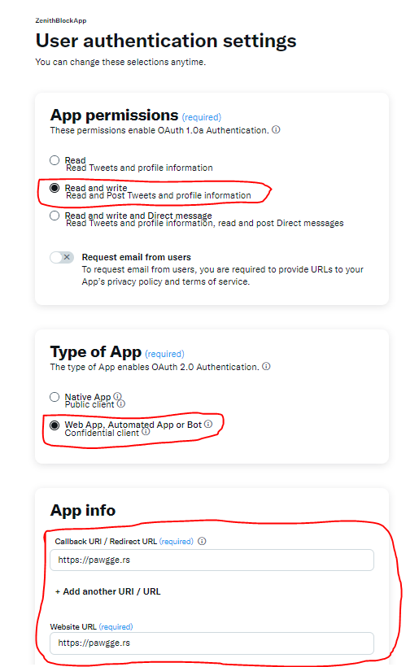
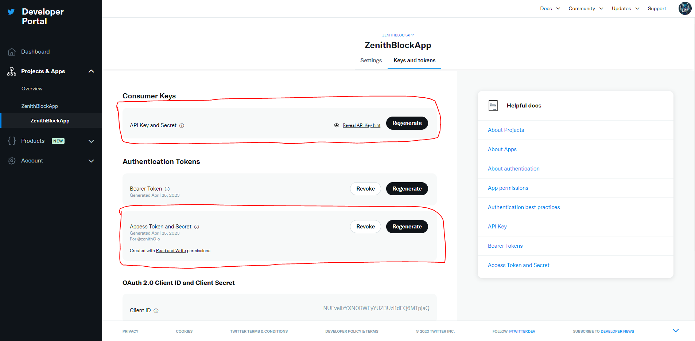

# twitter-blocker

A tool designed to block mass amounts of users using the Twitter API. Provide a list `list_ordered.txt` of user ids you want to block in descending order of priority.

**NOTE:** Make sure you keep up to date! Pull the latest changes for `list_ordered.txt`, as I will try to push updates on accounts that should be blocked.

## How to use

For the sake of allowing as many people as possible to use this tool, I will be writing in-depth instructions on how to get this tool to work. If you are more experienced of a developer there is a tl;dr at the end. Also, if there is a discrepancy in the instructions, please notify me or even send a PR for corrections.

**IF YOU NEED HELP FURTHER HELP/CANT GET SOMETHING TO WORK,** please feel free to also contact me through DM's on Twitter ([@zenithO_o](https://twitter.com/zenithO_o)), as I would like to improve the steps. It has been a long time since I started a project from scratch on a brand new Twitter account, so these instructions are to the best of my knowledge and what I have been told.

1. **Acquire a Twitter Developer account through [the Twitter Developer Platform](https://developer.twitter.com/).** If you need help with this process, [this link](https://www.youtube.com/watch?v=gLZE1L8UfqA) sends you to a YouTube video detailing how to apply for one (It is very outdated, but the idea is still about the same). I believe it is an automated process anyways, so should be able to acquire one easily as long as you have your phone number connected to the account. 

2. **Setup Twitter App.** Once you have a Dev account, setup an app with permissions to read and write to you account. You WILL need write permissions, since this is what allows the script to send a request to Twitter to create a block. If Twitter does not automatically allow you to generate read and write tokens for you account's Access tokens, you will have to set this up through the "User authentication settings" panel. When there, you HAVE to fill out the parts circled (Read and Write permissions, Confidential Client, Redirect URI, Website URL). For the website/redirect, put whatever you like! If this were a public-facing App, you would absolutely need to make a proper redirect, but since you are the only person using this tool on your account, it does not matter. 

3. **Get App Tokens/Keys** Once you have setup up the Twitter App, collect the Consumer Key, Consumer Key Secret, Access Token, and Access Token Secret from the "Keys and Tokens" page of the Twitter Developer. Paste them into the `'CONSUMER_KEY HERE', 'CONSUMER_SECRET_HERE', 'ACCESS_TOKEN_HERE', and 'ACCESS_TOKEN_SECRET_HERE'` fields inside `block_all.py`. Here is an image showing which keys: 

4. **Setup your Python environment.** If you got here, you're in the clear! It's not often that the code part is the easiest step :D. To setup up your python environment, [follow this Real Python tutorial](https://realpython.com/python-virtual-environments-a-primer/) on how to get a python virtual environment up and running! If you do not care, then just skip to the next step. This step is simply for organization, so it is not necessarily required.

5. **Install requirements.** In your python environment, run `pip install -r requirements.txt` OR just run `pip install tweepy`, as this is the only requirement for the project.

6. **Run block_all.py.** Last step! In your python environment, run `python block_all.py`. This will block EVERY user in the `list_ordered.txt` file, and save updates when an unexpected error occurs. From now on, this is the **ONLY** step you need to do once you have gotten steps 1-5 have been successfully completed. Be sure to check for updates with `list_ordered.txt`, as I will try to push updates on accounts that should be blocked.

**TL;DR:** Acquire Twitter Dev account, obtain keys for Twitter App, paste keys into block script, setup Python environment, run script, and enjoy!

## Currently Blocked Users

To generate this block list, I scraped these account's followers:

- @ValidLs
- @MalesInDisguise
- @NsPostingFs
- @WokelyCorrect
- @troonjacks
- @Thewokeexposed
- @GBT_Posting
- @TransphobicTf2
- @WokeParentLs
- @FloridasWs
- @PostingTransLs_

Some are more obvious than others, but all of them follow the same pattern of being hateful toward minority groups, especially those in the LGBTQ+ community. These are some of the more extreme "gimmick" accounts I could find in this context. In almost every case of a user following these accounts, it can be very safe to assume that they are have the same viewpoints! The list itself is categorized by follower count, blocking the largest accounts first.